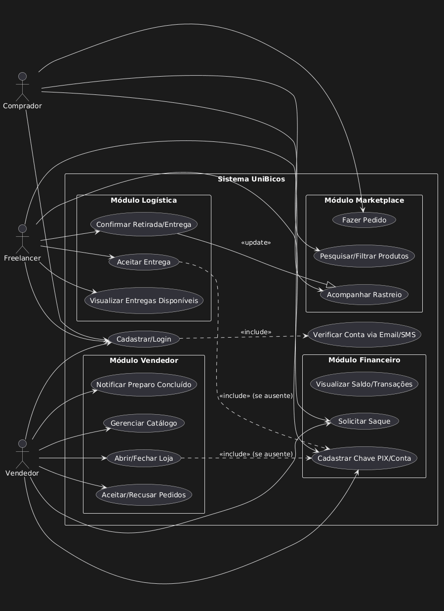
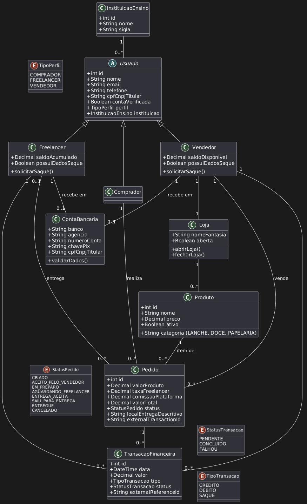
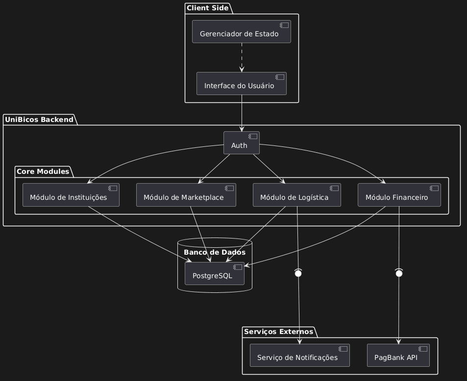

# 🎓📦 UniBicos Backend - API

O **UniBicos** é um ecossistema de delivery projetado exclusivamente para o ambiente universitário. A plataforma conecta **Compradores** (estudantes atarefados), **Freelancers** (estudantes com tempo livre) e **Vendedores** (comércios internos e informais) dentro da mesma instituição de ensino.

---

## 🖼️ Modelagem e Arquitetura

Abaixo estão as representações técnicas da estrutura do sistema.

### Diagrama de Casos de Uso

> Representa as interações entre as três personas e as funcionalidades centrais do sistema.
> 

### Diagrama de Classes

> Estrutura de dados, relacionamentos entre usuários, instituições, pedidos e transações.
> 

### Diagrama de Componentes

> Visão técnica da comunicação entre o Frontend (Next.js), Backend (Django), Banco de Dados (PostgreSQL) e APIs externas.
> 

---

## 🛠️ Tech Stack

- **Linguagem:** Python 3.12
- **Framework:** Django 6.0 & Django REST Framework (DRF)
- **Autenticação:** JWT (JSON Web Token) com verificação via E-mail/SMS.
- **Banco de Dados:** PostgreSQL.
- **Integração Financeira:** PagBank API.

---

## 📏 Regras de Negócio

### 1. Usuários e Autenticação

- **Unicidade:** Um e-mail por conta.
- **Perfis:** Escolha obrigatória entre `Comprador`, `Freelancer` ou `Vendedor`.
- **Vínculo Institucional:** Usuários só interagem com produtos/pedidos da sua própria instituição.
- **Documentação:** CPF obrigatório para Compradores e Freelancers. Vendedores podem usar CPF ou CNPJ.
- **Verificação:** A conta deve ser verificada antes do uso.

### 2. Regras de Produtos e Loja

- **Gestão:** Vendedores gerenciam apenas seus próprios produtos (Categorias: `LANCHE`, `DOCES`, `PAPELARIA`).
- **Status da Loja:** A loja possui os estados `ABERTA` ou `FECHADA`. Novos pedidos são bloqueados se a loja estiver fechada.
- **Visibilidade:** Apenas produtos ativos de lojas abertas aparecem no marketplace.

### 3. Fluxo do Pedido

| Status                  | Descrição                                             |
| :---------------------- | :---------------------------------------------------- |
| `CRIADO`                | Pedido realizado pelo comprador.                      |
| `ACEITO_PELO_VENDEDOR`  | Loja confirmou o pedido.                              |
| `EM_PREPARO`            | O produto está sendo preparado.                       |
| `AGUARDANDO_FREELANCER` | Produto pronto para retirada e entrega.               |
| `ENTREGA_ACEITA`        | Um freelancer assumiu a entrega.                      |
| `SAIU_PARA_ENTREGA`     | Freelancer retirou o produto no vendedor.             |
| `ENTREGUE`              | Ciclo finalizado com sucesso.                         |
| `CANCELADO`             | Permitido apenas até o status `ACEITO_PELO_VENDEDOR`. |

### 4. Regras de Entrega (Freelancer)

- **Limitação:** O freelancer pode possuir apenas **uma entrega ativa** por vez.
- **Transparência:** Visualização prévia do local de retirada, entrega e valor líquido antes do aceite.

### 5. Financeiro e Saques

- **Valor do pedido:** $Valor Total = Produto (Vendedor) + Taxa (Freelancer) + Comissão (Plataforma)$.
- **Saques:** Sem valor mínimo. Permitido **um saque por dia**.
- **Segurança:** O saldo interno só é debitado após a confirmação de sucesso pelo gateway de pagamento.

### 6. Bloqueios de Saque e Atividade

- **Freelancers:** Só podem visualizar e aceitar entregas se possuírem uma **Chave PIX ou Conta Bancária** cadastrada.
- **Vendedores:** Só podem abrir a loja e receber pedidos se possuírem dados de pagamento configurados.

---

## 🚀 Como Rodar o Projeto

### Pré-requisitos

- Python 3.12+
- PostgreSQL
- Git

### Instalação

1.  **Clone o repositório:**

    ```bash
    git clone [https://github.com/sua-organizacao/unibicos-backend.git](https://github.com/sua-organizacao/unibicos-backend.git)
    cd unibicos-backend
    ```

2.  **Configure o ambiente virtual:**

    ```bash
    python -m venv venv
    source venv/bin/activate  # Windows: venv\Scripts\activate
    ```

3.  **Instale as dependências:**

    ```bash
    pip install -r requirements.txt
    ```

4.  **Variáveis de Ambiente:**
    Crie um arquivo `.env` na raiz seguindo o modelo `.env.example`.

5.  **Banco de Dados e Execução:**

    ```bash
    python manage.py migrate
    python manage.py runserver
    ```

6.  **Seed de superuser:**

    ```bash
    python manage.py seed_superuser --email admin@unibicos.com --password "sua-senha" --nome "Admin" --telefone "11999999999"
    ```

    Você também pode usar variáveis de ambiente:
    `SEED_SUPERUSER_EMAIL`, `SEED_SUPERUSER_PASSWORD`, `SEED_SUPERUSER_NOME` e `SEED_SUPERUSER_TELEFONE`.

---

## 📝 Licença

Distribuído sob a licença MIT. Veja [LICENSE](LICENSE) para mais detalhes.
